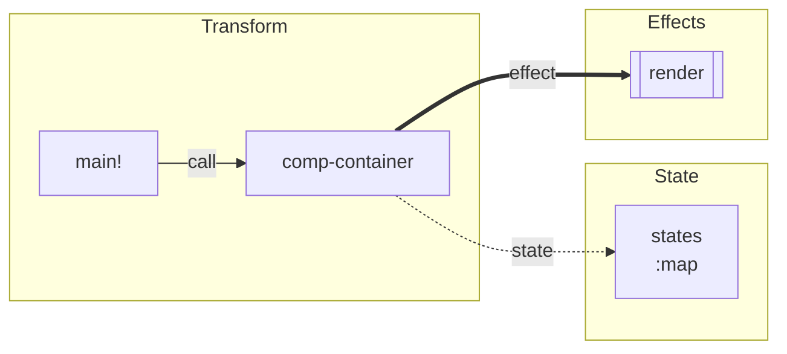

# RFC: `calcit analyze effects-graph` — State / Transform / Effect 分解图

状态：Draft  
日期：2026-06-15  
关联：`call_tree.rs`、`analyze check-types`、`03-05-function-schema-dual-track-rfc.md`、`02-18-language-theory-evolution-plan.md`

---

## 1. 概要

新增分析命令：

```bash
calcit analyze effects-graph [--root ns/def] [options...]
```

从**入口定义**（默认 `:init-fn`）出发，把程序（及其可达子函数）分解为三类信息，并输出一张可递归展开的分析图：

| 维度 | 含义 | 典型内容 |
|------|------|----------|
| **State** | 数据与可变状态 | 参数、返回值、局部绑定、atom/ref、结构体字段流、`d!` 更新槽 |
| **Transform** | 纯逻辑骨架（隐藏实现细节） | 签名、控制流轮廓、调用关系、可压缩的表达式摘要 |
| **Effect** | 除 state 端口外的副作用 | IO、控制台、异常、环境、宿主 API、渲染、异步、watch 回调 |

设计目标：**读图即可理解程序**，而不必展开完整 Cirru 源码。  
同一抽象可作用于整个程序，也可作用于任意单个 `ns/def` 节点（递归分解）。

---

## 2. 动机

### 2.1 现有 `analyze` 能力的缺口

| 已有命令 | 提供的信息 | 不足 |
|----------|------------|------|
| `call-graph` | 定义间**调用结构** | 不区分数据流与副作用；节点仍是“函数名 + doc” |
| `count-calls` | 调用频次 | 无语义分类 |
| `program-diff` | 版本间结构 diff | 不解释运行时语义 |
| `check-types` / `weak-types` | 类型覆盖与薄弱点 | 不组织为可导航的“程序理解图” |
| `query def` / `tree show` | 完整代码 | 细节过多，不适合宏观把握 |

Agent / 人类在理解 Respo 类 UI 程序时，真正关心的是：

- 哪些**状态槽**在流动（`states`、`*abort-control`、`message-box-state`）？
- 哪些函数在做**纯变换**（`map`、`filter`、格式化）？
- 哪些调用会**触达外部世界**（`render!`、`read-file`、`js/...`、`send-to-component!`）？

`effects-graph` 把这些维度显式化。

### 2.2 与“隐藏代码细节”的关系

Transform 不等于删除逻辑，而是**降采样**：

- 保留：分支结构、循环/折叠模式、关键调用边、类型签名
- 省略：字面量、局部临时变量名、宏展开后的噪声
- 可配置：`--detail full|summary|minimal`（默认 `summary`）

类比：`call-graph` 是**结构邻接图**；`effects-graph` 是**语义分解图**。

---

## 3. 核心概念

### 3.1 State

**定义**：在求值过程中可被命名、传递、持久化或观测的数据。

分类（`state.kind`）：

| kind | 说明 | 检测线索 |
|------|------|----------|
| `param` | 函数入参 | `defn` 参数列表 + schema `:args` |
| `return` | 函数返回值 | schema `:return`、尾表达式类型 |
| `local` | 局部绑定 | `let` / `&let` 绑定名 + 推断类型 |
| `atom` | 可变引用单元 | `defatom`、`atom`、`reset!`、`swap!` |
| `field` | 记录/map 字段流 | `assoc`、`get`、`%{}` 构造、`:key` 读写 |
| `import` | 跨 ns 引入的符号 | `:require` / `:refer` 解析结果 |
| `slot` | 框架约定状态槽 | Respo `states`、`d!` 第一参数模式 |

**State 端口（port）**：带方向的类型化槽位，形如：

```json
{
  "id": "app.comp.container/message-box-state:content",
  "kind": "field",
  "type": ":string",
  "direction": "inout",
  "source": "app.comp.container/comp-message-box:3.2"
}
```

`direction`：`in` | `out` | `inout` | `persist`（跨 reload 保留，如 atom）。

### 3.2 Transform

**定义**：在 state 端口之间建立映射的**可命名逻辑单元**，实现细节在输出中默认折叠。

一个 Transform 节点包含：

- `signature`：来自 `CodeEntry.:schema` 或 `hint-fn` 补全结果
- `control`：压缩后的控制流骨架（`if` / `cond` / `match` / `foldl` / `let` 深度）
- `calls`：调用的其他 Transform（指向子节点或外部 `fqn`）
- `summary`：一句话摘要（可选，来自 `:doc` 首行或规则生成）

示例（概念输出）：

```text
└── app.comp.container/comp-message-box  [transform]
    ├── state.in  message-box-state (:record)
    ├── state.out message-box-state (:record)
    ├── control   let → if focus-mode? → textarea | compact-div
    ├── calls     respo.core/textarea, respo.core/div, calcit.core/assoc
    └── effects   (none in pure branch)
```

**宏展开策略**：分析期展开一层；展开结果并入 Transform，不单独暴露宏内部符号（与 `call-graph` 跳过 macro 体一致）。

### 3.3 Effect

**定义**：改变外部世界、控制流、可观测性，或引入**非局部**语义的运算；**不把**已在 State 端口建模的纯数据传递算作 effect。

分类（`effect.kind`）只来自已有声明，不按定义名的拼写猜测（[#1567](https://github.com/calcit-lang/calcit/issues/1567)）：

| kind | 示例 | 来源 |
|------|------|------|
| `console` | `println`、`eprintln`、`echo`、`dbg`、`&inspect-methods` | `:log` tag（宿主注入 proc 的 descriptor tags） |
| `io/file` | `read-file`、`write-file`、`try-read-dir`、`.read-text`、`.write-text!` | `:file` tag |
| `io` | `monotonic-time-ms`、`unix-time-ms`、`wait-ms`、`read-stdin-text`、`generate-id!`、宿主注入的 `async-sleep` | 只有 `:io` tag |
| `env` | `get-env`、`get-args` | `:env` tag |
| `control` | `raise`、`quit!`、`try`、`todo!`、`non-nil!`、`assert=`、`assert-traits` | `:control` tag |
| `async` | `hint-fn $ {} (:async true)` | `hint-fn` 的 `:async` tag，且所在函数自身的单参数 hint schema 写有 `:async true`（与 JS lowering 同一判断）；`(:async false)`、普通类型提示、`:args` 中异步回调的函数类型以及带目标的双参数 `hint-fn` 都不算 |
| `state/watch` | `add-watch!`、`remove-watch!`、旧 `remove-watch` | `:watch` tag |
| `effect` | `.cancel!`、`.cancel-with!`、`.resolve!`、`.reject!`、旧 `.cancel`、`&doseq` | `:effect` tag |
| `interop/host` | `eval`、`&call-dylib-edn` | `:interop` tag |
| `interop/js` | `js/console.log`、`.!focus`（输出保留 `.!` 前缀）、`(|os :as os)` 导入的 `os/arch` | `js/` 命名空间、`.!` 调用与 JS 模块导入的语法 |
| `unknown` | 未加载的 `missing.ns/thing`、未声明 tags 的宿主 proc、项目自定义的方法、调用函数参数 `(f 1)` | 没有可读取的效果声明 |

**效果来源**按以下顺序确定，不再有按名字的兜底规则：

1. `calcit.core` 定义的 Snapshot `:tags`。没有 Snapshot entry 的少数 builtin proc / syntax 在 `src/effects_graph.rs` 的表中逐个声明，测试保证每个 proc/syntax 恰好有一处声明。core 定义没有效果 tag 即表示无效果。
2. 宿主注册 proc 的 `RegisteredProcDescriptor.tags`；descriptor 完全没有 tags 时报告 `unknown`。
3. 方法调用 `.name`（包括 `(receiver .name args)` 写法）查 core 的 `defimpl` / `&impl::new` 表，取实现定义的 tags；表中内联的实现（如 `&core-enum-methods` 里的 `defn &enum:empty?-impl`）沿用所在 core 定义的 tags。项目或模块也实现了同名方法，或 core 没有该方法时，报告 `unknown`，因为分派目标取决于运行时接收者。
4. 调用所在 `defn` / `defmacro` / `fn` 的参数，例如 `defn call-through (f) (f 1)`，调用的是调用方传入的函数值，报告 `unknown`。参数只在所在函数内有效；`let` / `loop` / `&let` / `if-let` / `when-let` / `&doseq` / `doseq` / `let[]` / `let{}` 绑定的同名局部会遮蔽参数。参数列表本身、上述绑定对与解构名，以及 `case` / `case-default` / `match` / `tag-match` / `list-match` / `struct-match` / `cond` 的分支不当作调用；`case-default` 的默认值按普通表达式分析。
5. 调用项目或模块定义时，调用点本身不记录效果；被调用定义作为调用图子节点，按同样规则列出自己的效果。

`unknown` 表示“分析器找不到声明”，不是“有副作用”，也不是“纯”。它出现在四类位置：限定名指向未加载的命名空间或定义、宿主 proc 未声明 tags、方法分派无法限定在 core 实现、调用函数参数。补全方式是加载对应模块、为宿主 proc 声明 tags，或在 core 定义上补 tag；不要通过改名来消除 `unknown`。

Effect 边：从 Transform 节点指向 effect 节点；effect 节点可带 `target`（文件路径、DOM、atom 名等）若可静态推导。

**与 State 的边界规则**：

- `assoc state :content x` → **state** 更新（field inout）
- `reset! *counter 1` → **state**（atom persist）+ 可选标 `effect/state-mutate`（若需区分“突变事件”）
- `render! (comp-container ...)` → 调用模块定义 `respo.core/render!`：调用点不重复记录效果，`render!` 子节点按其声明与调用链列出效果；参数中的 state 仍归 State 分析

第一版建议：**突变写入归 State，对外可观测归 Effect**，避免双重计数。

---

## 4. 与 Koka effect typing 的关系（借鉴而非照搬）

Koka 核心思想：函数类型携带 effect row，例如 `f : int -> console string`。

```koka
fun greet(name: string) : console ()
  println("hello " ++ name)
```

Calcit **不**在第一阶段引入完整 effect handler 语义（见 `02-18-language-theory-evolution-plan.md` 非目标），但借鉴：

| Koka 概念 | Calcit 对应（分阶段） |
|-----------|----------------------|
| effect row `<console, exn>` | `CodeEntry.:schema` 新增可选 `:effects` 列表 |
| pure function `()` | `:effects $ []` 或省略 |
| handled effect | 仅分析期标注，不要求 handler 语法 |
| `perform` / `ctl` | 无；用 builtin / 调用模式识别 |
| row polymorphism | 第二版：`:effects $ [] 'e` 泛型行变量（可选） |

### 4.1 建议的 schema 扩展（Phase B）

在现有 `:: :fn` payload 中增加：

```cirru
:schema $ :: :fn
  {}
    :args $ [] :dynamic
    :return :dynamic
    :effects $ [] :console :render
```

或独立 effect 声明（`defeffect` 已在 snapshot 词法表预留，尚未实现）：

```cirru
defeffect Render
  .mount :fn
  .patch :fn

defn render-once (ui) $
  hint-fn $ {} (:effects $ [] :render)
  render! ui
```

第一版 **不强制** 用户手写；`effects-graph --infer-missing` 可生成建议补丁。

### 4.2 内置 proc 的 effect schema

**首选数据源**：`calcit-core.cirru` 各 builtin 定义的 `:tags` 字段。分析器按 tag 映射到 effect kind，无需维护独立硬编码表。

#### Tag 约定（calcit.core）

| Tag | 含义 | 典型定义 |
|-----|------|----------|
| `:state` | 可变引用 / 本地可变容器 | `defatom`, `atom`, `reset!`, `swap!`, `deref`, `ref?`, `add-watch`, `remove-watch`, `&atom:deref`, `&buf-list:*` |
| `:io` | 宿主 / 运行时交互 | `read-file`, `write-file`, `get-env`, `cpu-time`, `&get-os`, `&get-calcit-*`；`println`/`eprintln`/`echo` 为宿主注入 |
| `:file` | 文件读写（`:io` 子类） | `read-file`, `write-file` |
| `:env` | 环境变量（`:io` 子类） | `get-env` |
| `:log` | 控制台输出（`:io` 子类） | `println`, `eprintln`, `echo`（宿主注入，见 Phase C） |
| `:control` | 控制流中断 | `raise`, `quit!`, `try`；测试宏 `assert`/`assert=`/`assert-detect`（失败时 `raise` + `eprintln`） |
| `:interop` | 宿主 FFI / dylib / 动态求值 | `&call-dylib-edn*`, `eval`, `js-object` |
| `:meta` | 程序自省 / 编译期元数据 | `&get-def-doc`, `&get-def-schema`, `macroexpand*`, `assert-type`, `deftype-slot`, `with-type-slot`, `&data-to-code`, `&extract-code-into-edn` |
| `:async` | 异步标记（经 `hint-fn`） | `hint-fn` |
| `:watch` | atom 监听回调 | `add-watch`, `remove-watch`（与 `:state` 叠加） |
| `:effect` | 显式状态写入、生命周期、注册与取消（与 [API 角色](../docs/features/api-roles.md#效果宿主与内部实现)中 `!` 的含义一致），以及显式副作用组合子 | `ffi-task:cancel`、`ffi-task:cancel-with`、`ffi-response:resolve`、`ffi-response:reject`、`&init-builtin-impls!`、`&reset-gensym-index!`、`&doseq` |

映射示例（tag → effects-graph kind）：

- `read-file` / `write-file` (`:io` `:file`) → `io/file`
- `raise` / `quit!` (`:control`) → `control`
- `get-env` (`:io` `:env`) → `env`
- `reset!` / `swap!` (`:state`) → State 端口的 atom 写入，不重复计入 effect
- `add-watch!` / `remove-watch` (`:state` `:watch`) → `state/watch`
- `eval` (`:interop`) → `interop/host`
- `hint-fn` (`:async`) → `async`，仅当所在函数自身的单参数 hint schema 写有 `:async true`；`:args` 中嵌套的异步回调类型不算
- `ffi-task:cancel` (`:effect`) → `effect`，`.cancel` 与 `.cancel!` 共享这一实现
- `println` (`:log` `:io`) → `console`

只有 `:io` 而没有更具体 tag 时归为 `io`。`:state`、`:meta`、`:data`、`:ffi` 不单独产生 effect kind。

宿主注入 proc 通过 `RegisteredProcDescriptor.tags`（`HashSet<EdnTag>`，与 core `:tags` 同名）声明；可用 `calcit query host-procs [--tag :log]` 查看。

---

## 5. 命令设计

### 5.1 语法

```bash
calcit analyze effects-graph [options]
```

与 `call-graph` 对齐的选项：

| 选项 | 说明 | 默认 |
|------|------|------|
| `--root ns/def` | 入口定义 | `:init-fn` |
| `--format tree\|json\|mermaid` | 输出格式 | `tree` |
| `--max-depth N` | 子图展开深度（0 为不限） | 2 |
| `--include-core` | 包含 `calcit.core` 节点 | false |
| `--ns-prefix PREFIX` | 只保留匹配 ns 子树 | 无 |
| `--detail summary\|full\|minimal` | Transform 压缩级别 | `summary` |
| `--infer-missing` | 输出类型/effect 补全建议 | false |
| `--show-transform-body` | 在 summary 模式下仍输出骨架 AST | false |

### 5.2 输出格式

## 输出格式（tree）

默认 `--max-depth 2`。超过深度的子节点标注 `[depth limit ↑]` 并给出一行摘要，按需 `--root ns/def` 或增大 `--max-depth` 展开；`--max-depth 0` 表示不限深度。`--format json` 时 stdout 只有一个 JSON 文档，起始提示行写到 stderr。

以下为 `calcit calcit/test-effects-graph.cirru analyze effects-graph --color false` 的节选（省略号处删去了其他子节点；没有效果的节点标 `[transform]`，有效果的标 `[program]`）：

```text
# Effects Graph: `main/main!`

Package: `test-effects-graph.*`
Max depth: 2  (2 nodes truncated; rerun with larger --max-depth to expand)

└── main/main!  [program]
    ├── Transform  (entry with io and state effects)
    │   ├── → main/state-helper
    │   ├── → main/io-helper
    │   ├── → main/setup!
    │   └── ...
    └── Effects
        └── console        println
    │
    ├── main/setup!  [transform]
    │   ├── Transform  (calls: 1)
    │   │   └── → main/load-config
    │   └── Effects
    │       └── (none — pure transform)
    │   │
    │   └── main/load-config  [depth limit ↑]
    ├── main/watch-helper  [program]
    │   ├── State
    │   │   └── watch    *store  schema: :number  init=0
    │   ├── Transform
    │   │   └── (no calls)
    │   └── Effects
    │       └── state/watch    remove-watch
    ├── main/cancel-helper  [program]
    │   ├── Transform
    │   │   └── (no calls)
    │   └── Effects
    │       └── effect         .cancel
    ├── main/call-through  [program]
    │   ├── Transform
    │   │   └── (no calls)
    │   └── Effects
    │       └── unknown        f
    ├── main/missing-helper  [program]
    │   ├── Transform  (calls: 1)
    │   │   └── → missing.ns/thing
    │   └── Effects
    │       └── unknown        missing.ns/thing
    │   │
    │   └── missing.ns/thing  [depth limit ↑]
    ├── main/collection-helper  [transform]
    │   ├── Transform
    │   │   └── (no calls)
    │   └── Effects
    │       └── (none — pure transform)
    ├── main/sync-hint-helper  [transform]
    │   ├── Transform
    │   │   └── (no calls)
    │   └── Effects
    │       └── (none — pure transform)
    ├── main/native-method-helper  [program]
    │   ├── Transform
    │   │   └── (no calls)
    │   └── Effects
    │       └── interop/js     .!focus
    ├── main/nested-async-hint-helper  [transform]
    │   ├── Transform
    │   │   └── (no calls)
    │   └── Effects
    │       └── (none — pure transform)
    ├── main/scope-helper  [program]
    │   ├── Transform  (control: map; calls: 1)
    │   │   ├── control: map
    │   │   └── → main/io-helper
    │   └── Effects
    │       └── unknown        io-helper
    │   │
    │   └── main/io-helper  [no analysis]
    └── main/case-default-helper  [program]
        ├── Transform
        │   └── (no calls)
        └── Effects
            └── unknown        d
```

`setup!` 和 `load-config` 不再因为名字含 `!` 或 `load` 被标为效果；`remove-watch` 和旧 `.cancel` 没有 `!`，仍由 core tags 识别。`call-through` 调用参数 `f`，分析器不知道调用方传入什么函数，因此报告 `unknown`。`collection-helper` 对列表调用 `.empty?` / `.contains?`，项目没有同名 `defimpl`，因此按 core 声明视为无效果。`sync-hint-helper` 的 `hint-fn $ {} (:async false)` 不算异步；`nested-async-hint-helper` 只在 `:args` 里声明异步回调类型，自身也不算异步。`scope-helper` 中内层 `fn (io-helper)` 的参数只在该 `fn` 内报告 `unknown`，外层 `io-helper |README.md` 仍调用同名定义。`case-default-helper` 的默认值 `(d)` 调用参数，报告 `unknown d`。

#### json

机器消费；节点类型：`program | transform | state_port | effect`。

#### mermaid（默认，birdview）

专注快速理解程序：**State** 数据结构与类型、**Transform** 关键函数连接、**Effects** 副作用种类。


```mermaid
flowchart LR
  subgraph stateLane["State"]
    s0["states<br/>:map"]
  end
  subgraph transformLane["Transform"]
    t0["main!"]
    t1["comp-container"]
  end
  subgraph effectLane["Effects"]
    e0[[render]]
  end
  t0 -->|call| t1
  t1 -.->|state| s0
  t1 ==>|effect| e0
```

- 蓝 = State（`name<br/>:type`）
- 黄 = Transform（关键 `ns/def` 简名）
- 红 = Effect（按 kind 聚合，隐藏具体 proc 细节）
- `-->` 函数调用 · `-.->` 状态关联 · `==>` 触发副作用

### 5.3 与 `call-graph` 的组合

推荐工作流：

1. `calcit analyze call-graph` — 看清**可达定义集合**
2. `calcit analyze effects-graph` — 在同一入口上读**语义分解**
3. `calcit analyze check-types --infer-missing` + `effects-graph --infer-missing` — 补齐 schema

---

## 6. 分析管线（实现架构）

### 6.1 模块划分

新增 `src/effects_graph.rs`（库模块），CLI 入口挂到 `calcit analyze`（`cli_args.rs` / `calcit.rs`），与 `call_tree` 并列。

```
effects_graph/
  mod.rs           # 公共类型、入口 analyze_effects_graph()
  extract.rs       # 从 Calcit/Cirru 提取 STE
  classify.rs      # proc/call → effect kind
  state.rs         # 参数、let、atom、assoc 数据流
  transform.rs     # 控制流骨架 + summary 生成
  infer.rs         # 缺 schema 时的补全建议
  format.rs        # tree / json / mermaid
```

**不修改求值语义**；仅在 preprocess 之后的 `PROGRAM_CODE_DATA` + `CompiledDef` 上只读分析（符合 `02-18` 保守试验约束）。

### 6.2 数据来源优先级

| 信息 | 来源 1 | 来源 2 | 来源 3 |
|------|--------|--------|--------|
| 参数/返回类型 | `CodeEntry.:schema` | `hint-fn` | 推断 `weak-types` |
| 文档摘要 | `&get-def-doc` / `entry.doc` | — | — |
| 调用目标 | `call_tree` 同款 `extract_calls` | — | — |
| Effect 种类 | core `:tags` 与 hidden proc 表 | 宿主 proc descriptor tags | 调用图子节点；均无声明时为 `unknown` |
| State 槽 | schema + `assoc`/`get` 模式 | atom 表 | — |

### 6.3 Transform 压缩算法（summary 模式）

1. 对 `defn` 体做**浅层**遍历，深度上限 `D=3`（可配置）
2. 保留：`if/cond/match/foldl/map/filter/let` 节点类型与子节点**类型标签**
3. 替换：字面量 → `_`；长字符串 → `"..."` ；大块 `quote` → `⟨quoted⟩`
4. 生成 `summary`：优先 `doc` 首句，否则模板 `"let×N, if×M, calls K"`

`full` 模式：输出类似 `calcit tree show --chunked` 的分片骨架（见 `03-18-query-def-tree-show-chunked-display-plan.md`），但不输出完整叶子。

### 6.4 类型补全（`--infer-missing`）

当某 `ns/def` 缺少 `:schema` 或 `:effects` 时：

1. 用现有 `analyze_code_entry` / type inference 收集 `:args`/`:return` 候选
2. 用 effect 分类器扫描函数体，汇总 effect 集合
3. 输出 unified diff 建议（仅 stdout 或 `--write-suggestions file` 未来扩展）

示例建议块：

```text
## Suggested schema patch: app.comp.container/comp-message-box
:schema $ :: :fn
  {}
    :args $ [] :dynamic
    :return :dynamic
    :effects $ [] :render :console
```

与 `calcit edit` 集成留作 Phase C。

---

## 7. 分阶段实施计划

### Phase A — 只读分析 MVP（4~6 周）

**交付**：

- [x] `calcit analyze effects-graph` tree + json 输出
- [x] 入口可达分析（复用 `CallTreeAnalyzer` 可达集）
- [x] State：`param` / `return` / `local` / `atom` 基础识别
- [x] Effect：builtin proc 表（core 全覆盖）
- [x] Transform：`summary` 模式 + `calls` 边
- [x] 测试：`calcit/test-effects-graph.cirru`（纯 calcit 小程序，不依赖 respo）

**非目标**：`:effects` schema、`defeffect`、mermaid、自动写回 snapshot。

### Phase B — 类型驱动 + 框架规则（4 周）

**交付**：

- [ ] `CodeEntry.:schema` 支持 `:effects` 列表（解析 + `check-types` 统计）
- [ ] Respo 等模块的效果识别：通过模块定义或宿主 proc 的显式声明，而不是按 `render!`、`d!`、`send-to-component!` 等名字建规则包
- [ ] `--infer-missing` 建议输出
- [ ] `mermaid` 格式
- [ ] 文档：`docs/features/effects-graph.md`

### Phase C — 生态与编辑器集成（后续）

- [x] `RegisteredProcDescriptor.tags`（与 core `:tags` 对齐）
- [ ] `defeffect` 语法落地（可选）
- [ ] `calcit analyze effects-graph-diff <git-ref>`（对齐 `program-diff`）
- [ ] Agent 指南：`calcit docs agents` 增加 effects-graph 工作流
- [ ] 与 `query def` 联动：`calcit query def ns/def --view effects`

---

## 8. 示例：Respo UI 程序片段

入口：`app.comp.container/comp-container`（msg-buffer 类项目）。

预期分解（示意）：

```text
app.comp.container/comp-container
├── state
│   ├── param   states (:map)           # Respo 组件状态
│   ├── param   cursor (:fn)            # d! 回调
│   ├── local   message-box-state
│   └── atom    *abort-control (persist)
├── transform
│   ├── comp-message-box(states, cursor)
│   ├── comp-sessions-modal(...)
│   └── cond done? / streaming? / ...
└── effects
    ├── render      respo.core/render!
    ├── interop     feather.core/comp-i
    ├── console     println (tests only)
    └── watch       (if add-watch present)
```

读者**无需打开** 1500 行 `calcit.cirru` 即可理解：状态在 `states` / `message-box-state`，UI 通过 `render!` 输出，流式中止走 `*abort-control`。

---

## 9. 测试策略

| 层级 | 内容 |
|------|------|
| 单元测试 | `classify_effect`, `extract_state_ports`, `compress_transform` |
| 集成测试 | 对 `calcit/test-effects-graph.cirru` 跑 `calcit analyze effects-graph --format json`，快照比对 |
| 回归 | 不改变现有 `call-graph` / `check-types` 行为 |
| 可选 | msg-buffer / respo 手工验收（不纳入 CI 硬依赖） |

---

## 10. 非目标（第一版）

- 不实现 Koka 式 `with/handler` 运行时语义
- 不改变 JS / WASM codegen
- 不做跨进程 / 网络 effect 的自动发现（除非显式 builtin）
- 不保证 whole-program 数据流**完备**（Halting 与动态调用不可判定）
- 不把 `effects-graph` 当作安全沙箱策略
- 不把效果加入函数类型；`effects-graph` 只读报告，不阻断编译或检查

### 限制

- 未解析到定义、又不是函数参数的裸符号（例如 `let` 绑定的函数值、只在 JS 后端提供的全局函数）不分类。
- 项目或模块实现了与 core 同名的方法时，所有该名字的方法调用都报告 `unknown`。
- 参数传给高阶函数（如 `map xs f`）或经 `let` 改名后再调用时不报告 `unknown`；`quote` 中的形式可能被当作调用报告。
- 项目与模块定义自身的 `:tags` 尚未读入，调用它们时只依靠调用图子节点。

---

## 11. 开放问题

1. **Transform 压缩深度默认值**：`D=3` 是否足够表达 Respo 组件？需用 msg-buffer 实测。
2. **`d!` 语义**：算 state 突变还是 effect？建议 state，但是否要单独 `effect/state-notify`？
3. **宏生成代码**：`quasiquote` 残留是否进入 Transform？建议分析**展开后** IR。
4. **递归节点展开**：同一 `fqn` 多次出现是 inline 子图还是 `seen` 引用（对齐 call-graph）？
5. **`:effects` 与 `:return` 交叉**：`:: :fn {:return :unit}` 且含 `:console` 是否强制标注？建议 warning。
6. **`defeffect` 与 `deftrait` 关系**：effect 是否复用 trait 机制？第一版独立，避免混淆。

---

## 12. 与现有 RFC 的衔接

| 文档 | 关系 |
|------|------|
| `03-05-function-schema-dual-track-rfc.md` | `:schema` 是 State/Transform 签名的主来源；本 RFC 扩展 `:effects` |
| `02-18-language-theory-evolution-plan.md` | 分析层优先、不求值语义变更 |
| `02-17-register-platform-api-rfc.md` | 宿主 proc effect 描述符 |
| `03-16-runtime-boundary-refactor-plan.md` | 长期 state slot 与 ref 显式化可强化 State 分析 |
| `05-12-program-diff-rfc.md` | 未来 `effects-graph-diff` 可对比 STE 结构变化 |

---

## 13. 验收标准（Phase A）

- [ ] `cargo run --bin calcit -- calcit/test.cirru analyze effects-graph` 成功退出
- [ ] 输出包含 entry 的 state / transform / effect 三节
- [ ] `read-file` 调用归类为 `io/file`，不落在 transform 摘要正文中
- [ ] `--format json` 可被 `jq` 解析，节点含 `fqn`、`kind`
- [ ] 文档与本 RFC 同步进入 `RFCs/README.md`
