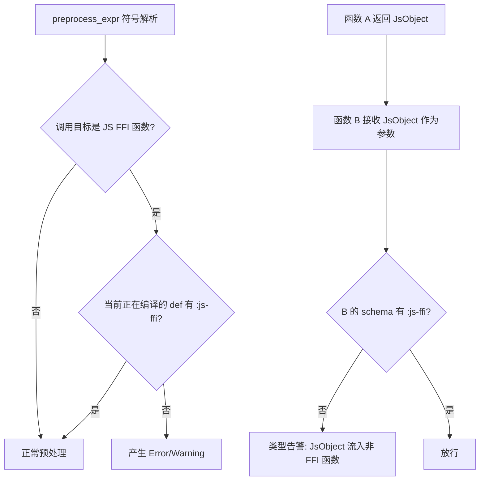

# RFC: `:features` 函数能力标记 + `:js-object` 类型收敛

状态：Draft
日期：2026-07-08

---

## 1. 概要

在函数 schema 中新增 `:features` 属性（HashSet），标记当前函数可使用的语言能力子集。默认空集合。使用 JS interop 语法（`aget`、`&js-object`、`new` 等）要求函数显式标记 `:features $ #{} :js-ffi`，从类型层面将 FFI 隔离在有限的 binding 函数中。

同步新增 `:js-object` 类型注解，表示 JavaScript FFI 操作产生的外部 opaque 数据，阻断 JS 对象向纯 Calcit 函数的无意识泄露。

## 2. 动机

### 问题

当前 JS FFI 函数（`is_js_syntax_procs` 收录 21 个）在 `codegen::codegen_mode()` 下全局放行，任何函数都可以随意调用：

```cirru
;; 任意函数都能直接调用 FFI，无任何约束
defn my-pure-fn (x)
  aget x |someProp  ;; 静默通过
  &js-object $ {} (:a 1)  ;; 静默通过
```

这导致：

- **边界模糊**：无法从代码中区分"纯 Calcit 函数"和"FFI binding 函数"
- **审查困难**：排查 JS interop 使用点需要全文搜索 21 个函数名
- **类型不安全**：JS 对象可以自由流经所有函数，静态分析无法追踪外部数据
- **重构风险**：修改 FFI 层时无法确定影响范围

### 目标

| 目标     | 说明                                                                     |
| -------- | ------------------------------------------------------------------------ |
| 权限收敛 | 只有 schema 中声明 `:js-ffi` 的函数才能调用 JS FFI                       |
| 类型隔离 | `:js-object` 类型标注 JS 对象，跨非 FFI 边界时产生告警                   |
| 渐进迁移 | 先 warning 后 error，给生态适配时间                                      |
| 可扩展   | `:features` 设计预留 `:side-effects`、`:async`、`:unsafe` 等未来能力标记 |

## 3. 设计

### 3.1 `:features` — Schema 属性

在 `CalcitFnTypeAnnotation` 中新增 `features` 字段：

```rust
pub struct CalcitFnTypeAnnotation {
    pub generics: Arc<Vec<Arc<str>>>,
    pub where_bounds: Arc<Vec<CalcitGenericBound>>,
    pub arg_types: Vec<Arc<CalcitTypeAnnotation>>,
    pub return_type: Arc<CalcitTypeAnnotation>,
    pub fn_kind: SchemaKind,
    pub rest_type: Option<Arc<CalcitTypeAnnotation>>,
    /// Feature flags declared in schema, e.g. `:features $ #{} :js-ffi`
    pub features: Arc<HashSet<EdnTag>>,
}
```

### 3.2 `:js-object` — 类型注解

在 `CalcitTypeAnnotation` 枚举中新增变体：

```rust
pub enum CalcitTypeAnnotation {
    // ... 现有变体不变 ...
    /// JavaScript FFI external object (opaque to Calcit type system)
    JsObject,
}
```

EDN 序列化：tag 名为 `:js-object`。

### 3.3 Canonical Cirru EDN 形态

```cirru
%{} :CodeEntry
  :doc "|FFI binding for DOM event handling"
  :code $ quote
    defn handle-click (event)
      let
          target $ aget event |target
          value $ aget target |value
        println value
  :schema $ :: :fn
    {}
      :args $ [] :js-object
      :return :unit
      :features $ #{} :js-ffi
```

一行 Cirru EDN 示例：

```cirru
(:: :fn ({} (:args ([] :js-object)) (:return :unit) (:features (#{} :js-ffi))))
```

### 3.4 校验流程



### 3.5 校验位置

| 校验点            | 位置                                       | 触发条件                                                                            |
| ----------------- | ------------------------------------------ | ----------------------------------------------------------------------------------- |
| FFI 函数调用      | `preprocess_expr` → `preprocess_list_call` | head 解析为 `is_js_syntax_procs` 且当前编译上下文中 `defn` 无 `:js-ffi`             |
| `ns js/...` 语法  | `preprocess_expr` 中 `RawCode(Js, _)` 分支 | 同上的 features 检查                                                                |
| `JsObject` 跨边界 | `check_user_fn_arg_types`                  | 实参类型为 `JsObject` 且形参 schema 非 `JsObject` 且函数无 `:js-ffi`                |
| `JsObject` 返回值 | `check_function_return_type`               | 返回值推断为 `JsObject` 且函数 schema 的 `:return` 非 `JsObject` 且函数无 `:js-ffi` |

### 3.6 默认值与兼容

- `:features` 默认 `Arc::new(HashSet::new())`，即空集合 = 无任何特殊能力
- `:js-object` 类型的默认行为：在无 `:js-ffi` 的函数中作为 `:dynamic` 等效处理（宽松模式），或产生类型告警（严格模式）
- 第一阶段以 **warning** 形式上线，通过 `--warn-ffi` flag 控制，后续升级为 error

## 4. FFI 函数清单

当前 `is_js_syntax_procs()` 收录的函数，全部受 `:js-ffi` 管控：

| 函数                                    | 用途                 | 返回类型建议               |
| --------------------------------------- | -------------------- | -------------------------- |
| `aget` / `js-get`                       | JS 属性读取          | `:js-object` 或 `:dynamic` |
| `aset` / `js-set`                       | JS 属性写入          | `:unit`                    |
| `js-delete`                             | JS 属性删除          | `:unit`                    |
| `exists?`                               | JS 属性存在性检查    | `:bool`                    |
| `instance?`                             | JS instanceof        | `:bool`                    |
| `&js-object`                            | 创建 JS 对象         | `:js-object`               |
| `js-array`                              | 创建 JS 数组         | `:js-object`               |
| `js-await` / `js-for-await`             | Promise/异步迭代     | `:js-object`               |
| `new`                                   | JS new 构造          | `:js-object`               |
| `set!`                                  | JS 赋值              | `:unit`                    |
| `to-js-data`                            | Calcit → JS 转换     | `:js-object`               |
| `to-calcit-data`                        | JS → Calcit 转换     | `:dynamic`                 |
| `extract-cirru-edn` / `to-cirru-edn`    | EDN 序列化           | `:string` / `:dynamic`     |
| `&raw-code`                             | 原始 JS 代码         | `:js-object`               |
| `timeout-call`                          | 异步定时             | `:js-object`               |
| `foldl`                                 | fold-left（JS 实现） | 依赖元素类型               |
| `load-console-formatter!` / `printable` | 控制台输出           | `:unit`                    |

> **注**：`foldl` 虽然在 JS FFI 列表中，但它是纯函数式的 fold 操作，未来可考虑移出 FFI 列表或单独归类。

## 5. 实现计划

### Phase 1: 数据层（~2h）

- [ ] `CalcitFnTypeAnnotation.features` 字段新增
- [ ] EDN 序列化 / 反序列化（`to_schema_edn` / `parse_loaded_schema_annotation`）
- [ ] `CalcitTypeAnnotation::JsObject` 变体新增 + 全量 match 补齐
- [ ] `JsObject` 的 EDN tag 解析（`:js-object`）

### Phase 2: 校验层（~4h）

- [ ] `preprocess_list_call` 中 FFI 调用权限校验
- [ ] `preprocess_expr` 中 `ns js/...` 语法的 FFI 权限校验
- [ ] 编译上下文传递：在 `ensure_ns_def_preprocessed` 链路中追踪当前 `defn` 的 features
- [ ] `check_user_fn_arg_types` 中 `JsObject` 跨边界告警
- [ ] `check_function_return_type` 中 `JsObject` 返回值告警
- [ ] `--warn-ffi` CLI flag（默认开启 warning 模式）

### Phase 3: 类型推断（~2h）

- [ ] `&js-object`、`js-array`、`new` 等 FFI 函数的返回值推断为 `JsObject`
- [ ] `aget` 对 `JsObject` 参数的接收校验
- [ ] `to-calcit-data` 作为 `JsObject → Dynamic` 的转换边界

### Phase 4: 迁移与测试（~3h）

- [ ] 现有 `calcit/` 下使用 JS FFI 的测试文件 schema 迁移
- [ ] 新增 `calcit/test-ffi-features.cirru` 测试用例：
  - 无 `:js-ffi` 调用 `aget` → 预期 warning/error
  - 有 `:js-ffi` 调用 `aget` → 预期通过
  - 无 `:js-ffi` 接收 `JsObject` 参数 → 预期类型告警
  - 有 `:js-ffi` 接收 `JsObject` → 预期通过
  - `to-calcit-data` 边界转换后不再需要 `:js-ffi`
- [ ] 文档更新（`docs/features.md`）

### Phase 5: 严格模式（后续版本）

- [ ] 缺少 `:js-ffi` 的 FFI 调用从 warning 升级为 hard error
- [ ] `:js-object` 可能扩展到区分 `:js-object` vs `:js-array` vs `:js-promise`

## 6. 风险与缓解

| 风险                                    | 影响               | 缓解                                                 |
| --------------------------------------- | ------------------ | ---------------------------------------------------- |
| 现有 Cirru 代码大量使用 FFI 但无 schema | 迁移工作量大       | 先 warning 后 error；提供迁移脚本                    |
| `foldl` 列入 FFI 引起误报               | 纯函数被标记为 FFI | 考虑将 `foldl` 移出 `is_js_syntax_procs` 或单独分类  |
| 宏生成的函数自动获取 `:js-ffi`          | 权限继承不明确     | 宏生成函数的 features 从宏定义处显式声明，不自动继承 |
| 第三方库适配周期长                      | 生态断裂           | 预留至少一个大版本的 warning-only 过渡期             |

## 7. 未来扩展

`:features` 设计为 `HashSet<EdnTag>`，天然支持未来新增能力标记：

| 标记            | 含义                                             |
| --------------- | ------------------------------------------------ |
| `:js-ffi`       | 可使用 JS interop 语法（本次实现）               |
| `:side-effects` | 函数可能产生副作用（未来：配合 effects graph）   |
| `:async`        | 函数内部使用异步操作（未来：配合 effect 系统）   |
| `:unsafe`       | 函数绕过了类型检查（未来：配合 unsafe block）    |
| `:host`         | 函数需要宿主环境 API（未来：配合多 target 编译） |

## 8. 参考资料

- 现有 JS FFI 函数定义：`src/builtins.rs:649` `is_js_syntax_procs()`
- 现有 Schema 结构：`src/calcit/type_annotation.rs:3826` `CalcitFnTypeAnnotation`
- 现有预处理入口：`src/runner/preprocess/mod.rs` `preprocess_expr()`
- 相关 RFC：[Type Slot 机制](./04-13-type-slot-mechanism-rfc.md)、[泛型 `:where` 约束](./05-31-generic-where-bounds-mfs.md)
