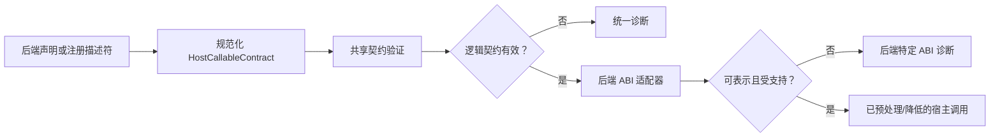

# RFC：跨后端宿主/FFI 契约与稳定宿主形状

状态：草案
日期：2026-08-08

## 1. 摘要

Calcit 应使用统一的逻辑契约模型描述 FFI 边界，同时允许 JavaScript、原生、WASM 及未来的后端保留适合各自运行时的语法和 ABI 规则。

共享模型包含两个相互独立的层次：

1. **宿主契约**：可调用签名、稳定的宿主值标识、字段/方法、可空性、效应、所有权和信任级别。
2. **后端传输**：JavaScript 属性访问、原生 registered-proc/句柄约定、WASM 标量或线性内存 ABI，以及后端特定的符号绑定。

后端声明会被规范化为 `HostCallableContract`。共享预处理负责验证源码层类型和能力；随后由后端适配器验证每种边界类型是否具有 ABI 表示。

JavaScript 是首个完整使用宿主形状的后端，因为 DOM 和 JavaScript API 会暴露稳定属性及接收者方法。本 RFC 不尝试建模 TypeScript、JavaScript 原型、任意变异、重载解析、条件类型或完整的 DOM 类型层级。

## 2. 动机

当前的边界机制已经体现了目标模型的一部分：

- 函数 schema 携带参数/返回类型、泛型、`:where`、剩余参数，以及 `:js-ffi` 等 `:features`。
- JavaScript 原始值以 `JsNullish<JsObject>` 保守表示。
- 原生注册过程具有描述参数个数、平台、稳定性、回调位置和效应标签的描述符。
- `defwasm-import` 和 `defwasm-export` 声明宿主符号，并使用定义 schema 进行 `Number`/`String` ABI 验证。

这些机制虽有用，却彼此割裂：

- JS 推断了解宿主可空性，却不了解稳定的属性类型。
- registered-proc 描述符了解可用性和参数个数，却不共享完整的函数 schema 检查器。
- WASM 在代码生成内部验证 ABI 可表示性，而不是通过可复用的宿主契约阶段验证。
- 即使底层错误相同，诊断仍使用后端特定的表述：未声明的能力、不完整的签名、不可表示的类型、不安全的宿主值流或无效的边界转换。

目标不是统一语法，而是在语义相同之处统一逻辑。

## 3. 目标

1. 为导入/导出的宿主可调用项定义统一的内部契约。
2. 定义具名、稳定的宿主值类型，但不将其等同于 Calcit `Struct` 或 `Map`。
3. 跨后端复用参数、返回值、泛型绑定、回调、能力和诊断检查。
4. 保留后端特定的 ABI、所有权、可空性和符号绑定规则。
5. 在不模拟 TypeScript 的前提下，使 DOM 和常规 JavaScript API 绑定切实可用。
6. 允许原生和 WASM FFI 渐进采用同一契约。
7. 默认保持原始/未验证宿主值的不透明性。

## 4. 非目标

- 导入或求值任意 TypeScript 声明文件。
- TypeScript 结构化类型、条件/映射类型、声明合并、重载排序或环境模块。
- 建模任意 JavaScript 原型变异、具有隐藏效应的 getter、代理或动态属性创建。
- 使 Calcit 结构体与 JavaScript 对象、原生结构体或 WASM 内存记录二进制兼容。
- 为所有后端提供统一的源码语法。
- 提供通用序列化格式或零拷贝保证。
- 以宿主可空性或宿主错误取代名义类型 `Option`/`Result`。
- 在本 RFC 中将内部 WASM 验证后端作为公开目标。

## 5. 术语

- **宿主**：普通 Calcit 值与调用之外的执行环境。
- **宿主值**：其表示或行为由宿主运行时所有的值。
- **宿主类型**：描述 Calcit 可以在宿主值上安全执行哪些操作的具名契约。
- **宿主形状**：宿主类型的字段/方法投影。宿主类型可以是不透明的，因而没有形状。
- **宿主可调用项**：FFI 边界处导入或导出的函数。
- **逻辑类型**：静态检查所使用、Calcit 可见的类型关系。
- **传输类型**：逻辑类型的后端 ABI 表示。
- **解码器**：从不可信宿主值到更强契约或普通 Calcit 数据的受检转换。
- **可信断言**：由外部契约证明合理的显式未检查转换。

## 6. 设计原则

### 6.1 逻辑契约与 ABI 传输相互独立

一个 `String -> String` 宿主可调用项只有一个逻辑签名。JavaScript 可以直接传递宿主字符串，原生代码可能使用由 ABI 管理的字符串，而 WASM 当前传递编码为 `f64` 的逻辑指针。这些传输细节不得泄漏到普通函数类型匹配中。

### 6.2 宿主类型不是 Calcit 结构体

Calcit `Struct` 具有 Calcit 的构造、字段、相等性、序列化和后端表示语义，JavaScript DOM 节点或原生文件句柄则不具备这些语义。因此，即便宿主类型暴露稳定的具名字段，它仍拥有独立的名义标识。

### 6.3 原始边界保持不透明

未声明的 `js/...`、`aget`、原生方法调用、动态加载的符号及未知宿主结果仍会产生不透明宿主值。增加形状语法后，也不得仅根据属性拼写推断可信形状。

### 6.4 更强类型需要证据

值只能通过以下方式之一获得具名宿主类型：

- 声明的宿主可调用项返回类型；
- 受检解码器；
- 后端提供且标识匹配的描述符；
- unsafe/互操作边界中的显式可信断言。

空值/存在性检查只收窄可空性，并不能证明载荷形状。

### 6.5 共享检查先于后端 lowering

调用参数个数、参数/返回值匹配、泛型绑定、回调签名、能力要求、可空性和宿主标识属于语言检查。ABI 可表示性、符号命名、内存布局、所有权转移和接收者调用约定属于适配器检查。

## 7. 共享内部模型

以下名称仅用于示意 Rust 结构，并非已承诺的公开 API。

```rust
pub struct HostCallableContract {
  pub backend: HostBackend,
  pub direction: HostDirection,
  pub source_name: Arc<str>,
  pub host_symbol: HostSymbol,
  pub fn_type: Arc<CalcitFnTypeAnnotation>,
  pub required_features: Arc<HashSet<EdnTag>>,
  pub effects: Arc<HashSet<EdnTag>>,
  pub stability: HostStability,
  pub transport: HostTransportSpec,
}

pub enum HostDirection {
  Import,
  Export,
}

pub enum HostBackend {
  Js,
  Native,
  Wasm,
  Wasi,
  Named(Arc<str>),
}

pub struct HostTypeDef {
  pub name: EdnTag,
  pub backend: HostBackend,
  pub fields: Arc<Vec<HostField>>,
  pub methods: Arc<Vec<HostMethod>>,
  pub openness: HostShapeOpenness,
  pub transport: HostTransportSpec,
}
```

`HostTransportSpec` 是由后端定义并持有的元数据。共享检查器将其视为适配器输入，而非源码层类型关系。

类型注解层增加名义宿主引用：

```rust
CalcitTypeAnnotation::Host(Arc<HostTypeDef>)
```

迁移期间，现有 `JsObject` 仍是 JavaScript 的不透明顶层类型。现有 `JsNullish<T>` 仍是 JavaScript 的 null/undefined 包装器，既可包装 `JsObject`，也可包装具名 JS 宿主类型。

## 8. 源码层宿主类型声明

本 RFC 提议将 `defhost-type` 作为稳定宿主值标识的通用声明形式。后端调用声明可以继续采用专用形式。

```cirru.no-check
defhost-type DomInput $ {}
  :backend :js
  :openness :closed
  :fields $ {}
    |value $ {} (:type 'String) (:presence :required) (:access :read-write)
    |checked $ {} (:type 'Bool) (:presence :required) (:access :read-write)
    |form $ {} (:type 'DomForm) (:presence :nullish) (:access :read)
  :methods $ {}
    |focus $ {}
      :args $ []
      :return 'Unit
      :effects $ #{} :dom
```

原生不透明资源可以使用相同的无字段标识形式：

```cirru.no-check
defhost-type FileHandle $ {}
  :backend :native
  :openness :opaque
  :transport $ {} (:kind :handle) (:ownership :owned)
```

WASM 可见的内存记录最终可以使用：

```cirru.no-check
defhost-type PixelBuffer $ {}
  :backend :wasm
  :openness :opaque
  :transport $ {}
    :kind :linear-memory
    :codec 'app.ffi/PixelBufferCodec
```

WASM 声明并不意味着可以访问属性。值如何跨越线性内存由编解码器/布局适配器决定。

### 8.1 规范宿主类型引用

具名宿主类型使用普通的具名 schema 引用：

```cirru.no-check
:: 'Fn $ {}
  :args $ [] 'DomInput
  :return $ :: 'JsNullish 'DomForm
  :features $ #{} :js-ffi
```

`TypeRef` 在当前解析具名结构体/枚举的同一阶段解析为 `Host`。这样既可保持函数 schema 的名义性，也避免引入第二套引用语法。

### 8.2 字段契约

MVP 字段元数据包括：

- `:type`：逻辑字段类型；
- `:presence`：`:required` 或 `:nullish`；
- `:access`：`:read`、`:write` 或 `:read-write`。

`required` 表示绑定契约保证值存在，而不是根据观察到的对象推断得出。`nullish` 表示读取会产生后端的可空性包装器；对 JavaScript 而言即 `JsNullish<T>`。

### 8.3 方法契约

方法显式保留接收者语义：

- 参数不包含接收者；
- 后端适配器执行接收者调用；
- 返回值可空性独立声明；
- 每个方法均可附加效应/能力。

宿主方法不会仅因读取属性就转换为普通 Calcit `Fn`。这可避免丢失 JavaScript `this`、原生 vtable/句柄上下文或 WASM 资源标识。

### 8.4 开放、封闭与不透明形状

- `:opaque`：静态情况下没有可用的字段或方法投影。
- `:closed`：访问未声明的属性/方法会产生诊断。
- `:open`：检查已声明成员；未声明成员回退为后端不透明宿主类型，并产生显式的低置信度诊断。

MVP 支持 `:opaque` 和 `:closed`。`:open` 延后至具体生态用例提出需求时实现。

## 9. 后端可调用项声明

后端特定语法继续有效，但每项声明都必须规范化为 `HostCallableContract`。

### 9.1 JavaScript

JavaScript 绑定可以是带有强 schema 和 `:js-ffi` 的普通定义，也可以采用未来用于绑定模块/全局符号的声明形式。现有原始语法仍然可用且保持不透明。

```cirru.no-check
defn query-input (selector)
  .?!querySelector js/document selector
```

Schema：

```cirru.no-check
:: 'Fn $ {}
  :args $ [] 'String
  :return $ :: 'JsNullish 'DomInput
  :features $ #{} :js-ffi
```

该 schema 之所以可信，仅因为此函数是显式 FFI 绑定。若无解码器或可信断言，普通函数不能将任意 `JsObject` 表达式注解为 `DomInput`。

### 9.2 原生注册过程

`RegisteredProcDescriptor` 应演进为引用或嵌入源码定义所使用的同一套完整函数 schema：

```rust
pub struct RegisteredProcDescriptor {
  pub fn_type: Option<Arc<CalcitFnTypeAnnotation>>,
  // 现有的平台、稳定性、文档、回调及标签元数据
}
```

迁移期间仍接受参数个数元数据。当 `fn_type` 存在时，参数个数由其推导，不一致会成为注册错误。平台/稳定性/标签直接映射到共享可调用项契约。

原生不透明句柄使用具名宿主类型。运行时注册负责维护从 `Calcit` 宿主值表示到该名义标识的映射；普通 Calcit 代码无法构造这种值。

### 9.3 WASM 导入与导出

现有语法保持不变：

```cirru.no-check
defwasm-import host-string-upcase (text) |host |string-upcase

defwasm-export wasm-ffi-upcase (text)
  host-string-upcase text
```

定义 schema 成为 `HostCallableContract` 中的逻辑签名。WASM 适配器检查可表示性，并将各类型降低为当前 ABI 表示。

初期支持的逻辑类型仍限于已实现的 `Number`、`String` 和 `Unit`。只有当宿主类型的 `:transport` 具有受支持的 WASM 编解码器/布局时，才会接受该宿主类型。这样可使形状检查与 ABI 支持独立演进。

### 9.4 WASI

WASI 使用共享的可调用项/类型契约及独立适配器。不能将其视为通用 WASM 的同义词：WASI 的能力、资源、字符串/列表约定和错误模型均不同于由 JavaScript 托管的内部 WASM 模块。

## 10. 共享验证管线



### 10.1 共享检查

共享验证器负责：

- 可调用项种类和完整函数 schema；
- 必需/固定/剩余参数个数；
- 参数和返回类型匹配；
- 泛型绑定和 `:where` 约束；
- 回调签名和位置；
- 宿主类型标识和后端兼容性；
- 可空性包装器兼容性；
- 必需的函数/方法能力；
- 导入/导出方向规则；
- 稳定性和效应元数据规范化；
- 受检边界转换与可信边界转换之分。

这些检查应复用现有的 `CalcitFnTypeAnnotation`、`matches_with_bindings`、调用参数检查、返回值检查和结构化诊断。

### 10.2 后端适配器检查

适配器负责：

- 符号/模块命名；
- 从逻辑类型到传输类型的映射；
- 接收者调用约定；
- 所有权/借用/生命周期规则；
- 回调跳板支持；
- 同步/异步限制；
- 内存布局和编解码器可用性；
- 错误/陷阱/异常转换；
- 后端可用性。

### 10.3 诊断

共享诊断代码应尽可能与后端无关：

- `E_HOST_CONTRACT_SCHEMA`：可调用项 schema 缺失或不一致；
- `E_HOST_TYPE_MISMATCH`：参数/返回值/字段不满足逻辑契约；
- `E_HOST_CAPABILITY_REQUIRED`：声明或调用缺少必需特性；
- `E_HOST_BACKEND_MISMATCH`：宿主类型属于其他后端；
- `E_HOST_MEMBER_UNKNOWN`：封闭宿主形状中没有已声明的该成员；
- `E_HOST_MEMBER_ACCESS`：违反字段可变性/访问规则；
- `E_HOST_UNCHECKED_NARROWING`：在没有证据的情况下将不透明值视为具名宿主类型；
- `E_HOST_ABI_UNSUPPORTED`：逻辑类型没有适配器表示；
- `E_HOST_OWNERSHIP`：无法满足所有权/生命周期契约。

消息可附加后端细节，但不改变语义代码，例如：`E_HOST_ABI_UNSUPPORTED backend=wasm logical=PixelBuffer reason=missing codec`。

## 11. JavaScript 稳定形状语义

JavaScript 是首个实现字段和方法投影的后端。

### 11.1 属性读取

对于接收者类型 `Host<DomInput>`：

- 通过 `.-value` 读取必需字段 `value: String` 时推断为 `String`；
- 可空字段 `form: DomForm` 推断为 `JsNullish<Host<DomForm>>`；
- 可选访问 `.?-value` 始终保留 JS 可空语义；
- 访问封闭形状上的未知成员会报告 `E_HOST_MEMBER_UNKNOWN`；
- 原始 `JsObject` 访问仍为 `JsNullish<JsObject>`。

对于接收者类型 `JsNullish<Host<DomInput>>`，普通解引用保留现有的可空解引用诊断。存在性收窄仅移除外层 `JsNullish`。

### 11.2 属性写入

写入需要满足：

- 字段已声明为 `:write` 或 `:read-write`；
- 赋入值匹配逻辑字段类型；
- 接收者不可空；
- 具备 `:js-ffi` 能力。

本 RFC 不提议流敏感的别名分析。外部变异可能使运行时值失效，但不会改写已声明的契约。

### 11.3 方法

对于具名封闭形状，原生 JS 调用（`.!focus`、`.?!focus`）只解析已声明的宿主方法。方法契约负责验证参数和返回类型。普通 Calcit 方法分派（`.focus`）继续与其分离。

### 11.4 DOM 范围

初始 DOM 层应经过精选并保持精简：

- 现有应用所需的事件目标/值字段；
- `Document.querySelector` 和少量常用元素方法；
- 仅在稳定契约明确时提供存储和定时器 API。

绑定可以位于模块中，而不必进入核心。核心类型系统提供宿主契约，无需附带完整的 Web 平台。

### 11.5 明确不支持的 JavaScript 行为

MVP 不建模：

- 重载集合；
- 字符串/数值索引签名；
- 原型继承或声明合并；
- 在效应不可忽略时将 getter/setter 视为透明字段；
- 将可调用对象或构造器视为形状；
- 任意联合类型/交叉类型；
- 条件类型、映射类型、模板字面量类型或 `keyof` 类型；
- 自动导入 `.d.ts`。

后续 `.d.ts` 工具可以生成受支持的少量契约子集，但生成的声明必须经过同一验证器，不支持的特性会成为错误，而不是被擦除为 `Dynamic`。

## 12. 转换与信任模型

以下三种操作必须保持区分：

1. **存在性收窄**：在已证明的分支内将 `JsNullish<T> -> T`。它不验证 `T`。
2. **受检解码**：将 `HostOpaque -> Result<Host<T>, HostDecodeError>`，或转换为普通 Calcit 数据。它根据解码器策略验证必需成员/值种类。
3. **可信断言**：不经过运行时检查，将 `HostOpaque -> Host<T>`。它需要 unsafe/互操作能力，并产生可审计元数据。

确切的公开名称延后决定。实现不得静默复用通用 `unsafe-coerce`，而不记录目标宿主标识和源码位置。

宿主形状是互操作行为的契约，而非封闭数据 schema。除非显式编解码器将其转换为普通 Calcit 数据，否则 `data-shape`、EDN 编码、相等性、哈希和持久化操作都拒绝它们。

## 13. 所有权与生命周期

共享模型定义术语，适配器负责实施语义：

- `:borrowed`：仅在宿主调用或回调期间有效；
- `:shared`：由宿主管理的共享引用；
- `:owned`：所有权转移给 Calcit 侧包装器/资源；
- `:copy`：按值传输；
- `:static`：宿主保证其具有进程/模块生命周期。

JavaScript GC 引用通常映射到 `:shared`。原生句柄可以是 `:owned` 或 `:borrowed`。WASM 指针需要内存所有者，不能仅因其数值表示可复制就默认为 `:shared`。

MVP 仅为不透明宿主类型记录所有权，并在生命周期范围已知时验证明显的逃逸错误。完整借用检查不在范围内。

## 14. 错误与异步契约

FFI 失败应在逻辑层显式表达：

- 预期的领域失败使用 `Result<T,E>`；
- 一般的值缺失使用 `Option<T>`；
- JavaScript `null`/`undefined` 在原始宿主边界仍表示为 `JsNullish<T>`；
- 后端陷阱/异常/panic 转换属于适配器策略，不得伪装为一般的值缺失。

异步行为同样由适配器决定，但在共享元数据中声明。宿主可调用项可以要求 `:async`；JavaScript 将其映射到 Promise/`js-await`，原生后端可以使用回调/future 注册，而 WASM/WASI 在适配器存在之前可以拒绝它。

## 15. 兼容性与迁移

1. `JsObject` 和 `JsNullish<JsObject>` 仍是有效的不透明边界。
2. 在没有声明时，现有 JS 语法不会获得推断出的具名形状。
3. 现有 `RegisteredProcDescriptor` 参数个数/平台字段继续有效。
4. 现有 `defwasm-import`/`defwasm-export` 语法保持不变。
5. 注册过程缺少完整元数据时，初期仅产生分析输出；现有运行时调用不会立即被拒绝。
6. 具名宿主类型采用显式启用方式，初期仅限具有 FFI 特性的函数。
7. 仅升级编译器无需迁移源码。

## 16. 实施阶段

### 阶段 0：契约提取

- 引入后端无关的 `HostCallableContract` 和 `HostAbiAdapter` 接口。
- 在不改变行为的情况下，将 WASM 声明和 registered-proc 描述符规范化为契约。
- 复用统一的参数个数/schema/能力诊断路径。
- 在 `cr query context`、`query host-procs` 和 JSON 协议输出中暴露契约。

### 阶段 1：名义不透明宿主类型

- 添加 `HostTypeDef` 和 `CalcitTypeAnnotation::Host`。
- 添加解析/序列化/显示/类型引用解析/泛型替换/类型覆盖支持。
- 为原生句柄和 JS 可信绑定支持 `:opaque` 宿主类型。
- 在封闭数据/data-shape 操作中拒绝宿主类型。

### 阶段 2：JavaScript 封闭形状

- 为 `:backend :js` 添加 `defhost-type` 字段/方法。
- 实现精确的属性读写和原生方法推断。
- 独立于形状标识保留 `JsNullish`。
- 添加受检解码器和可审计的可信断言。
- 发布精简的外部 DOM 绑定模块。

### 阶段 3：原生 schema 集成

- 允许 registered-proc 描述符提供完整的 `CalcitFnTypeAnnotation` 和宿主类型引用。
- 从函数 schema 推导参数个数/回调检查。
- 添加不透明句柄所有权元数据和运行时标识检查。

### 阶段 4：WASM 传输适配器

- 将现有 Number/String 可表示性检查移到 `HostAbiAdapter` 之后。
- 为选定的宿主类型和线性内存记录添加显式编解码器。
- 除非确实存在逻辑宿主对象 API，否则保持禁用属性投影。
- 将 WASI 视为独立适配器，与其他适配器共享同一逻辑契约层。

### 阶段 5：工具支持

- 添加 `cr query host-type`、`cr query host-callable` 和契约诊断。
- 添加生成绑定验证，并提供稳定的机器可读封装格式。
- 可选地从精选元数据或受限 `.d.ts` 子集生成受支持的宿主声明。

## 17. 验证策略

共享契约测试：

- JS/原生/WASM 声明间一致的参数/返回值不匹配诊断；
- 复用泛型和回调绑定；
- 后端不匹配和能力错误；
- 宿主类型标识和可空性不匹配；
- 契约 JSON 稳定性。

JavaScript 测试：

- 类 DOM 的必需/可空字段；
- 未知/只读字段诊断；
- 方法接收者和返回值推断；
- 不透明值不能静默变为具名形状；
- 存在性收窄不验证形状。

原生测试：

- 描述符/schema 参数个数一致性；
- 平台和稳定性元数据；
- 不透明句柄标识和所有权错误；
- 已注册回调签名检查。

WASM 测试：

- 现有 Number/String 导入与导出保持二进制兼容；
- 不支持的逻辑类型在进入发射器内部之前失败；
- 由编解码器支持的宿主类型确定性地映射到 ABI 类型；
- 导入/导出诊断使用共享代码并附加 WASM 细节。

仓库门禁仍包括 `cargo test`、对受影响 crate 执行严格 clippy、`yarn compile`、`yarn check-agent-interface`，以及后端特定的集成测试套件。

## 18. 风险

### 契约复杂性进入核心

缓解措施：保持共享模型小于任何单个后端的模型。后端专属事实仍作为适配器元数据，不能参与普通类型匹配。

### 形状意外演变为 TypeScript 克隆

缓解措施：MVP 仅包含名义宿主类型、必需/可空字段、访问模式和接收者方法。不支持的 TypeScript 特性会显式失败。

### 已声明的 JS 形状过时

缓解措施：形状获取必须显式进行；不可信输入使用受检解码器。精选 DOM 绑定是有版本的模块，而非编译器假设。

### 原生/WASM 所有权定义不足

缓解措施：从不透明句柄及现有标量/字符串传输开始。在适配器声明所有权和编解码器/布局之前，不接受类似指针的形状。

### 真相来源重复

缓解措施：函数 schema 就是逻辑签名。描述符和后端声明引用它；推导出的参数个数或 ABI 元数据必须接受一致性检查，而不是独立维护。

## 19. 开放问题

1. `defhost-type` 应作为核心语法、生成元数据的宏，还是仅在预处理期间消费的带标签数据声明？
2. JS 绑定函数是否应自动信任其声明的宿主返回类型，还是要求使用区别于普通 `defn :js-ffi` 的专用声明/标签？
3. 受检形状解码是否只验证成员存在性和基础值类型，还是应从首个版本起就支持用户提供的验证器？
4. 如何在运行时表示原生注册值的宿主类型标识，同时又不强制每个嵌入方将值包装到同一种通用容器中？
5. 所有权元数据应出现在源码 schema 中，还是完全保留在后端传输声明中？
6. 当 WASM 成为公开目标时，其编解码器声明应是源码定义、构建配置，还是生成的元数据？

## 20. 决策门槛

只有就以下各点达成一致后，才能开始实施：

- 宿主逻辑类型与 Calcit `Struct` 不同；
- 共享契约验证与 ABI 降低相互分离；
- 原始值保持不透明，更强的形状需要证据；
- JS MVP 有意保持低于 TypeScript 的复杂度；
- 原生和 WASM 可以使用不同声明，但会规范化为同一个内部契约；
- 阶段 0 期间保留现有 WASM ABI 和 registered-proc 兼容性。

## 21. 相关文档

- `RFCs/07-08-ffi-features-and-js-object-type-rfc.md`
- `RFCs/02-17-register-platform-api-rfc.md`
- `RFCs/04-15-wasm-compilation-feasibility.md`
- `RFCs/04-16-wasm-data-structures.md`
- `RFCs/07-31-unsafe-coerce-driven-static-type-boundary-plan.md`
- `RFCs/08-05-systematic-nil-reduction-rfc.md`
- `docs/features/js-interop.md`
- `calcit/scripts/wasm-validation.md`
