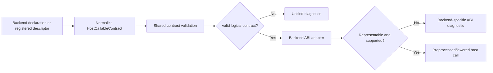

# RFC: Cross-backend Host/FFI Contracts and Stable Host Shapes

Status: Draft
Date: 2026-08-08

## 1. Summary

Calcit should describe FFI boundaries with one logical contract model while allowing JavaScript, native, WASM, and future backends to keep syntax and ABI rules appropriate to their runtimes.

The shared model has two separate layers:

1. **Host contract**: callable signature, stable host value identity, fields/methods, nullability, effects, ownership, and trust level.
2. **Backend transport**: JavaScript property access, native registered-proc/handle conventions, WASM scalar or linear-memory ABI, and backend-specific symbol binding.

A backend declaration is normalized into a `HostCallableContract`. Shared preprocessing validates source-level types and capabilities; a backend adapter then validates whether every boundary type has an ABI representation.

JavaScript is the first full shape consumer because DOM and JavaScript APIs expose stable properties and receiver methods. This RFC does not attempt to model TypeScript, JavaScript prototypes, arbitrary mutation, overload resolution, conditional types, or the complete DOM type hierarchy.

## 2. Motivation

Current boundaries already expose parts of the desired model:

- Function schemas carry argument/return types, generics, `:where`, rest arguments, and `:features` such as `:js-ffi`.
- JavaScript raw values are conservatively represented as `JsNullish<JsObject>`.
- Native registered procedures have descriptors for arity, platforms, stability, callback position, and effect tags.
- `defwasm-import` and `defwasm-export` declare a host symbol and use the definition schema for `Number`/`String` ABI validation.

These mechanisms are useful but disconnected:

- JS inference knows host nullability but not stable property types.
- Registered-proc descriptors know availability and arity but do not share the full function schema checker.
- WASM validates ABI representability inside codegen rather than through a reusable host-contract phase.
- Diagnostics use backend-specific language even when the underlying error is the same: undeclared capability, incomplete signature, unrepresentable type, unsafe host-value flow, or invalid boundary conversion.

The goal is not identical syntax. The goal is identical logic where the semantics are identical.

## 3. Goals

1. Define one internal contract for imported/exported host callables.
2. Define named stable host value types without equating them with Calcit `Struct` or `Map`.
3. Reuse argument, return, generic binding, callback, capability, and diagnostic checks across backends.
4. Preserve backend-specific ABI, ownership, nullability, and symbol binding rules.
5. Make DOM and ordinary JavaScript API bindings practical without simulating TypeScript.
6. Allow native and WASM FFI to adopt the same contract incrementally.
7. Keep raw/unverified host values opaque by default.

## 4. Non-goals

- Importing or evaluating arbitrary TypeScript declaration files.
- TypeScript structural typing, conditional/mapped types, declaration merging, overload ranking, or ambient modules.
- Modeling arbitrary JavaScript prototype mutation, getters with hidden effects, proxies, or dynamic property creation.
- Making Calcit structs binary-compatible with JavaScript objects, native structs, or WASM memory records.
- One universal source syntax for all backends.
- A universal serialization format or zero-copy guarantee.
- Replacing nominal `Option`/`Result` with host nullability or host errors.
- Making the internal WASM validation backend a public target as part of this RFC.

## 5. Terminology

- **Host**: execution environment outside ordinary Calcit values and calls.
- **Host value**: a value whose representation or behavior is owned by a host runtime.
- **Host type**: a named contract describing operations Calcit may safely perform on a host value.
- **Host shape**: the field/method projection of a host type. A host type may be opaque and have no shape.
- **Host callable**: imported or exported function at an FFI boundary.
- **Logical type**: Calcit-visible type relation used by static checking.
- **Transport type**: backend ABI representation of a logical type.
- **Decoder**: checked conversion from an untrusted host value to a stronger contract or ordinary Calcit data.
- **Trusted assertion**: explicit unchecked conversion justified by an external contract.

## 6. Design principles

### 6.1 Logical contract and ABI transport are separate

A `String -> String` host callable has one logical signature. JavaScript can pass a host string directly, native code may use an ABI-owned string, and WASM currently passes a logical pointer encoded as `f64`. Those transports must not leak into ordinary function type matching.

### 6.2 Host types are not Calcit structs

A Calcit `Struct` has Calcit construction, field, equality, serialization, and backend representation semantics. A JavaScript DOM node or native file handle does not. A host type therefore has separate nominal identity even when it exposes stable named fields.

### 6.3 Raw boundaries remain opaque

Undeclared `js/...`, `aget`, native method calls, dynamically loaded symbols, and unknown host results continue to produce an opaque host value. Adding shape syntax must not infer a trusted shape from property spelling alone.

### 6.4 Stronger types require evidence

A value receives a named host type only through one of:

- a declared host callable return type;
- a checked decoder;
- a backend-provided descriptor with matching identity;
- an explicit trusted assertion in an unsafe/interop boundary.

A null/presence check narrows nullability only. It does not prove the payload shape.

### 6.5 Shared checks run before backend lowering

Call arity, argument/return matching, generic binding, callback signatures, capability requirements, nullability, and host identity are language checks. ABI representability, symbol naming, memory layout, ownership transfer, and receiver calling convention are adapter checks.

## 7. Shared internal model

The names are illustrative Rust structures, not committed public APIs.

```rust
pub struct HostCallableContract {
  pub backend: HostBackend,
  pub direction: HostDirection,
  pub source_name: Arc<str>,
  pub host_symbol: HostSymbol,
  pub fn_type: Arc<CalcitFnTypeAnnotation>,
  pub required_features: Arc<HashSet<EdnTag>>,
  pub effects: Arc<HashSet<EdnTag>>,
  pub stability: HostStability,
  pub transport: HostTransportSpec,
}

pub enum HostDirection {
  Import,
  Export,
}

pub enum HostBackend {
  Js,
  Native,
  Wasm,
  Wasi,
  Named(Arc<str>),
}

pub struct HostTypeDef {
  pub name: EdnTag,
  pub backend: HostBackend,
  pub fields: Arc<Vec<HostField>>,
  pub methods: Arc<Vec<HostMethod>>,
  pub openness: HostShapeOpenness,
  pub transport: HostTransportSpec,
}
```

`HostTransportSpec` is backend-owned metadata. The shared checker treats it as an adapter input, not as a source-level type relation.

The type annotation layer gains a nominal host reference:

```rust
CalcitTypeAnnotation::Host(Arc<HostTypeDef>)
```

Existing `JsObject` remains the opaque JavaScript top type during migration. Existing `JsNullish<T>` remains the JavaScript null/undefined wrapper and may wrap either `JsObject` or a named JS host type.

## 8. Source-level host type declarations

The RFC proposes `defhost-type` as a common declaration form for stable host value identity. Backend call declarations may remain specialized.

```cirru.no-check
defhost-type DomInput $ {}
  :backend :js
  :openness :closed
  :fields $ {}
    |value $ {} (:type 'String) (:presence :required) (:access :read-write)
    |checked $ {} (:type 'Bool) (:presence :required) (:access :read-write)
    |form $ {} (:type 'DomForm) (:presence :nullish) (:access :read)
  :methods $ {}
    |focus $ {}
      :args $ []
      :return 'Unit
      :effects $ #{} :dom
```

A native opaque resource can use the same identity without fields:

```cirru.no-check
defhost-type FileHandle $ {}
  :backend :native
  :openness :opaque
  :transport $ {} (:kind :handle) (:ownership :owned)
```

A WASM-visible memory record may eventually use:

```cirru.no-check
defhost-type PixelBuffer $ {}
  :backend :wasm
  :openness :opaque
  :transport $ {}
    :kind :linear-memory
    :codec 'app.ffi/PixelBufferCodec
```

The WASM declaration does not imply property access. The codec/layout adapter decides how the value crosses linear memory.

### 8.1 Canonical host type reference

Named host types use ordinary named schema references:

```cirru.no-check
:: 'Fn $ {}
  :args $ [] 'DomInput
  :return $ :: 'JsNullish 'DomForm
  :features $ #{} :js-ffi
```

A `TypeRef` resolves to `Host` in the same phase that it currently resolves named structs/enums. This keeps function schemas nominal and avoids a second reference grammar.

### 8.2 Field contract

MVP field metadata contains:

- `:type`: logical field type;
- `:presence`: `:required` or `:nullish`;
- `:access`: `:read`, `:write`, or `:read-write`.

`required` means the binding contract guarantees a present value. It is not inferred from an observed object. `nullish` means reading yields the backend nullability wrapper; for JavaScript this is `JsNullish<T>`.

### 8.3 Method contract

Methods explicitly preserve receiver semantics:

- arguments exclude the receiver;
- the backend adapter performs the receiver call;
- return nullability is declared independently;
- effects/capabilities may be attached per method.

A host method is not converted to an ordinary Calcit `Fn` merely by reading the property. This avoids losing JavaScript `this`, native vtable/handle context, or WASM resource identity.

### 8.4 Open, closed, and opaque shapes

- `:opaque`: no field or method projection is statically available.
- `:closed`: undeclared property/method access is a diagnostic.
- `:open`: declared members are checked; undeclared members fall back to the backend opaque host type with an explicit low-confidence diagnostic.

MVP supports `:opaque` and `:closed`. `:open` is deferred until a concrete ecosystem use requires it.

## 9. Backend callable declarations

Backend-specific syntax remains valid, but every declaration must normalize into `HostCallableContract`.

### 9.1 JavaScript

JavaScript bindings may be ordinary definitions with a strong schema and `:js-ffi`, or a future declaration form that binds a module/global symbol. Existing raw syntax remains available and opaque.

```cirru.no-check
defn query-input (selector)
  .?!querySelector js/document selector
```

Schema:

```cirru.no-check
:: 'Fn $ {}
  :args $ [] 'String
  :return $ :: 'JsNullish 'DomInput
  :features $ #{} :js-ffi
```

The schema is trusted only because this function is an explicit FFI binding. A normal function cannot annotate an arbitrary `JsObject` expression as `DomInput` without a decoder or trusted assertion.

### 9.2 Native registered procedures

`RegisteredProcDescriptor` should evolve to reference or embed the same complete function schema used by source definitions:

```rust
pub struct RegisteredProcDescriptor {
  pub fn_type: Option<Arc<CalcitFnTypeAnnotation>>,
  // existing platform, stability, docs, callback, and tags metadata
}
```

During migration, arity metadata remains accepted. When `fn_type` exists, arity is derived and inconsistencies are registration errors. Platform/stability/tags map directly to the shared callable contract.

Native opaque handles use named host types. Runtime registration owns the mapping from `Calcit` host value representation to that nominal identity; ordinary Calcit code cannot construct one.

### 9.3 WASM imports and exports

Existing syntax remains:

```cirru.no-check
defwasm-import host-string-upcase (text) |host |string-upcase

defwasm-export wasm-ffi-upcase (text)
  host-string-upcase text
```

The definition schema becomes the logical signature in `HostCallableContract`. The WASM adapter checks representability and lowers each type to the current ABI.

Initially supported logical types remain `Number`, `String`, and `Unit` where already implemented. A host type is accepted only when its `:transport` has a supported WASM codec/layout. This lets shape checking and ABI support evolve independently.

### 9.4 WASI

WASI uses the shared callable/type contract and a distinct adapter. It must not be treated as synonymous with generic WASM: WASI capabilities, resources, string/list conventions, and error models differ from a JavaScript-hosted internal WASM module.

## 10. Shared validation pipeline



### 10.1 Shared checks

The shared validator owns:

- callable kind and complete function schema;
- required/fixed/rest arity;
- argument and return type matching;
- generic binding and `:where` constraints;
- callback signature and position;
- host type identity and backend compatibility;
- nullability wrapper compatibility;
- required function/method capabilities;
- import/export direction rules;
- stability and effect metadata normalization;
- checked versus trusted boundary conversion.

These checks should reuse existing `CalcitFnTypeAnnotation`, `matches_with_bindings`, call argument checking, return checking, and structured diagnostics.

### 10.2 Backend adapter checks

The adapter owns:

- symbol/module naming;
- logical-to-transport type mapping;
- receiver calling convention;
- ownership/borrowing/lifetime rules;
- callback trampoline support;
- sync/async restrictions;
- memory layout and codec availability;
- error/trap/exception translation;
- backend availability.

### 10.3 Diagnostics

Shared diagnostic codes should be backend-neutral where possible:

- `E_HOST_CONTRACT_SCHEMA`: missing or inconsistent callable schema;
- `E_HOST_TYPE_MISMATCH`: argument/return/field does not satisfy the logical contract;
- `E_HOST_CAPABILITY_REQUIRED`: declaration or call lacks a required feature;
- `E_HOST_BACKEND_MISMATCH`: host type belongs to a different backend;
- `E_HOST_MEMBER_UNKNOWN`: closed host shape has no declared member;
- `E_HOST_MEMBER_ACCESS`: field mutability/access violation;
- `E_HOST_UNCHECKED_NARROWING`: opaque value was treated as a named host type without evidence;
- `E_HOST_ABI_UNSUPPORTED`: logical type has no adapter representation;
- `E_HOST_OWNERSHIP`: ownership/lifetime contract cannot be satisfied.

Messages append backend detail without changing the semantic code, for example: `E_HOST_ABI_UNSUPPORTED backend=wasm logical=PixelBuffer reason=missing codec`.

## 11. JavaScript stable shape semantics

JavaScript is the first backend to implement field and method projection.

### 11.1 Property reads

For receiver type `Host<DomInput>`:

- required field `value: String` through `.-value` infers `String`;
- nullish field `form: DomForm` infers `JsNullish<Host<DomForm>>`;
- optional access `.?-value` always preserves JS nullish semantics;
- unknown member on a closed shape reports `E_HOST_MEMBER_UNKNOWN`;
- raw `JsObject` access remains `JsNullish<JsObject>`.

For receiver type `JsNullish<Host<DomInput>>`, plain dereference retains the existing nullable-dereference diagnostic. Presence narrowing removes only the outer `JsNullish`.

### 11.2 Property writes

A write requires:

- a declared `:write` or `:read-write` field;
- an assigned value matching the logical field type;
- a non-nullish receiver;
- `:js-ffi` capability.

No flow-sensitive alias analysis is proposed. External mutation may invalidate runtime values but does not rewrite the declared contract.

### 11.3 Methods

Native JS invocation (`.!focus`, `.?!focus`) resolves only declared host methods for a named closed shape. The method contract validates arguments and return type. Ordinary Calcit method dispatch (`.focus`) remains separate.

### 11.4 DOM scope

The initial DOM layer should be curated and small:

- event target/value fields needed by existing applications;
- `Document.querySelector` and a few common element methods;
- storage and timer APIs only where stable contracts are clear.

Bindings may live in a module rather than core. The core type system provides host contracts; it does not need to ship the complete web platform.

### 11.5 Explicitly unsupported JavaScript behavior

MVP does not model:

- overload sets;
- string/number index signatures;
- prototype inheritance or declaration merging;
- getters/setters as transparent fields when effects matter;
- callable objects or constructors as shapes;
- arbitrary unions/intersections;
- conditional, mapped, template-literal, or `keyof` types;
- automatic `.d.ts` ingestion.

A later `.d.ts` tool may generate the small supported contract subset, but generated declarations pass through the same validator and unsupported features are errors, not `Dynamic` erasure.

## 12. Conversion and trust model

Three operations must remain distinct:

1. **Presence narrowing**: `JsNullish<T> -> T` inside a proven branch. It does not validate `T`.
2. **Checked decoding**: `HostOpaque -> Result<Host<T>, HostDecodeError>` or conversion to ordinary Calcit data. It validates required members/value kinds according to a decoder policy.
3. **Trusted assertion**: `HostOpaque -> Host<T>` without runtime checks. It requires an unsafe/interop capability and emits auditable metadata.

Exact public names are deferred. The implementation must not reuse general `unsafe-coerce` silently without recording the target host identity and source location.

Host shapes are contracts for interop operations, not closed-data schemas. `data-shape`, EDN encoding, equality, hashing, and persistence reject them unless an explicit codec converts them to ordinary Calcit data.

## 13. Ownership and lifetime

The shared model defines vocabulary but adapters enforce semantics:

- `:borrowed`: valid only during the host call or callback;
- `:shared`: host-managed shared reference;
- `:owned`: ownership transfers to Calcit-side wrapper/resource;
- `:copy`: transported by value;
- `:static`: host guarantees process/module lifetime.

JavaScript GC references normally map to `:shared`. Native handles may be `:owned` or `:borrowed`. WASM pointers require a memory owner and cannot default to `:shared` merely because their numeric representation is copyable.

MVP records ownership only for opaque host types and validates obvious escape errors where lifetime scope is known. Full borrow checking is out of scope.

## 14. Error and async contracts

FFI failures should be explicit at the logical layer:

- expected domain failure uses `Result<T,E>`;
- ordinary absence uses `Option<T>`;
- JavaScript `null`/`undefined` remains `JsNullish<T>` at the raw host boundary;
- backend trap/exception/panic translation is adapter policy and must not masquerade as ordinary absence.

Async behavior is also adapter-specific but declared in shared metadata. A host callable can require `:async`; JavaScript maps this to Promise/`js-await`, native may use callback/future registration, and WASM/WASI may reject it until an adapter exists.

## 15. Compatibility and migration

1. `JsObject` and `JsNullish<JsObject>` remain valid opaque boundaries.
2. Existing JS syntax does not gain inferred named shapes without declarations.
3. Existing `RegisteredProcDescriptor` arity/platform fields continue to work.
4. Existing `defwasm-import`/`defwasm-export` syntax remains unchanged.
5. Missing complete metadata starts as analysis output for registered procs; existing runtime calls are not immediately rejected.
6. Named host types are opt-in and initially restricted to FFI-feature functions.
7. No source migration is required merely to upgrade the compiler.

## 16. Implementation phases

### Phase 0: contract extraction

- Introduce backend-neutral `HostCallableContract` and `HostAbiAdapter` interfaces.
- Normalize WASM declarations and registered-proc descriptors into contracts without changing behavior.
- Reuse one arity/schema/capability diagnostic path.
- Expose contracts in `cr query context`, `query host-procs`, and JSON protocol output.

### Phase 1: nominal opaque host types

- Add `HostTypeDef` and `CalcitTypeAnnotation::Host`.
- Add parse/serialize/display/type-ref resolution/generic substitution/type coverage.
- Support `:opaque` host types for native handles and JS trusted bindings.
- Reject host types from closed-data/data-shape operations.

### Phase 2: JavaScript closed shapes

- Add `defhost-type` fields/methods for `:backend :js`.
- Implement exact property read/write and native-method inference.
- Preserve `JsNullish` independently from shape identity.
- Add checked decoder and auditable trusted assertion.
- Publish a small external DOM binding module.

### Phase 3: native schema integration

- Allow registered-proc descriptors to provide full `CalcitFnTypeAnnotation` and host type references.
- Derive arity/callback checks from the function schema.
- Add opaque handle ownership metadata and runtime identity checks.

### Phase 4: WASM transport adapters

- Move existing Number/String representability checks behind `HostAbiAdapter`.
- Add explicit codecs for selected host types and linear-memory records.
- Keep property projection disabled unless a logical host object API is actually present.
- Treat WASI as a separate adapter sharing the same logical contract layer.

### Phase 5: tooling

- Add `cr query host-type`, `cr query host-callable`, and contract diagnostics.
- Add generated-binding validation with a stable machine-readable envelope.
- Optionally generate supported host declarations from curated metadata or a restricted `.d.ts` subset.

## 17. Validation strategy

Shared contract tests:

- identical argument/return mismatch diagnostics across JS/native/WASM declarations;
- generic and callback binding reuse;
- backend mismatch and capability errors;
- host type identity and nullability mismatch;
- contract JSON stability.

JavaScript tests:

- DOM-like required/nullish fields;
- unknown/read-only field diagnostics;
- method receiver and return inference;
- opaque value cannot silently become a named shape;
- presence narrowing does not validate shape.

Native tests:

- descriptor/schema arity consistency;
- platform and stability metadata;
- opaque handle identity and ownership errors;
- registered callback signature checking.

WASM tests:

- existing Number/String imports and exports remain binary-compatible;
- unsupported logical type fails before emitter internals;
- codec-backed host type maps deterministically to ABI types;
- import/export diagnostics use shared codes plus WASM details.

Repository gates remain `cargo test`, strict clippy for touched crates, `yarn compile`, `yarn check-agent-interface`, and backend-specific integration suites.

## 18. Risks

### Contract complexity moves into core

Mitigation: keep the shared model smaller than any backend. Backend-only facts remain adapter metadata and cannot participate in ordinary type matching.

### Shapes become an accidental TypeScript clone

Mitigation: MVP has nominal host types, required/nullish fields, access mode, and receiver methods only. Unsupported TypeScript features fail explicitly.

### Declared JS shape becomes stale

Mitigation: shape acquisition is explicit; untrusted input uses checked decoders. Curated DOM bindings are versioned modules, not compiler assumptions.

### Native/WASM ownership is underspecified

Mitigation: begin with opaque handles and existing scalar/string transports. Do not accept pointer-like shapes until an adapter declares ownership and codec/layout.

### Duplicate sources of truth

Mitigation: the function schema is the logical signature. Descriptors and backend declarations reference it; derived arity or ABI metadata must be checked for consistency rather than maintained independently.

## 19. Open questions

1. Should `defhost-type` be core syntax, a metadata-producing macro, or a tagged data declaration consumed only during preprocessing?
2. Should JS binding functions trust their declared return host type automatically, or require a dedicated declaration/tag distinct from an ordinary `defn :js-ffi`?
3. Should checked shape decoding validate only member presence and primitive kinds, or support user-provided validators from the first version?
4. How should host type identity be represented at runtime for native registered values without forcing every embedder to wrap values in one common container?
5. Should ownership metadata appear in source schemas or remain entirely in backend transport declarations?
6. When WASM becomes a public target, should its codec declarations be source definitions, build configuration, or generated metadata?

## 20. Decision threshold

Implementation should begin only after agreement on these points:

- host logical type is distinct from Calcit `Struct`;
- shared contract validation is separated from ABI lowering;
- raw values remain opaque and stronger shapes require evidence;
- JS MVP stays deliberately below TypeScript complexity;
- native and WASM may use different declarations while normalizing into the same internal contract;
- existing WASM ABI and registered-proc compatibility are preserved during Phase 0.

## 21. Related documents

- `RFCs/07-08-ffi-features-and-js-object-type-rfc.md`
- `RFCs/02-17-register-platform-api-rfc.md`
- `RFCs/04-15-wasm-compilation-feasibility.md`
- `RFCs/04-16-wasm-data-structures.md`
- `RFCs/07-31-unsafe-coerce-driven-static-type-boundary-plan.md`
- `RFCs/08-05-systematic-nil-reduction-rfc.md`
- `docs/features/js-interop.md`
- `calcit/scripts/wasm-validation.md`
